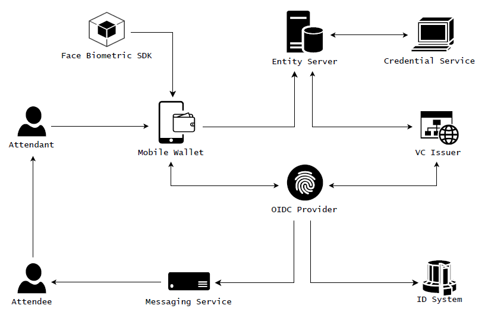
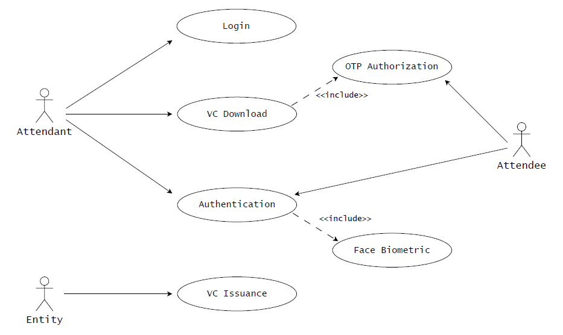
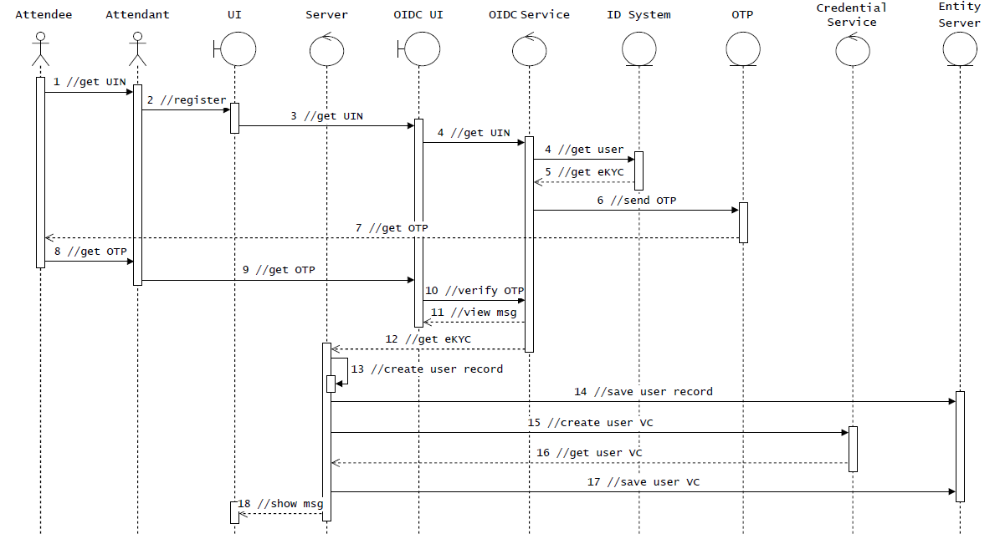
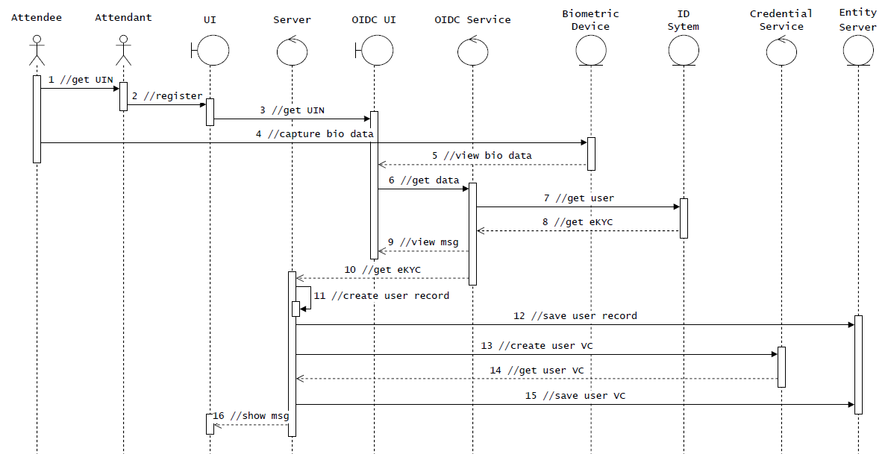
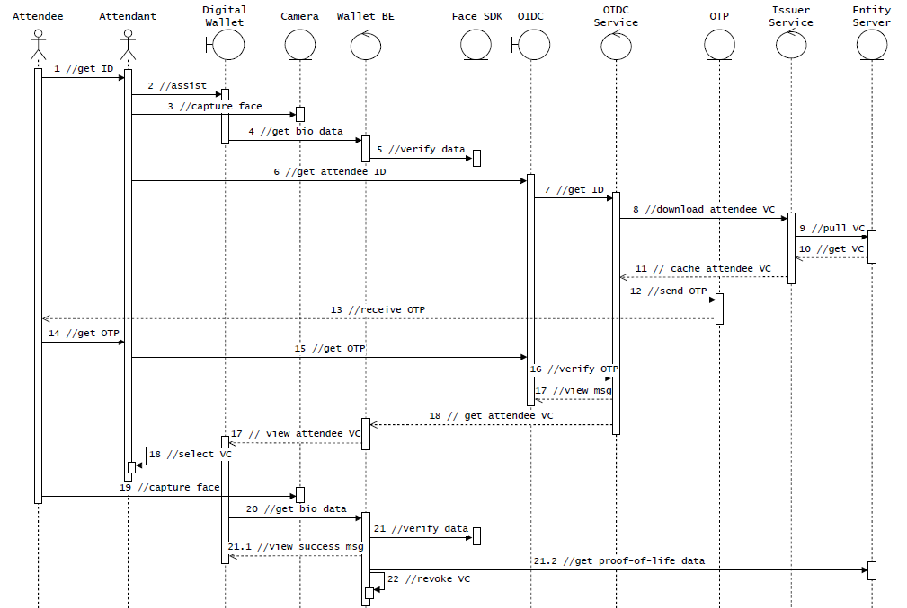
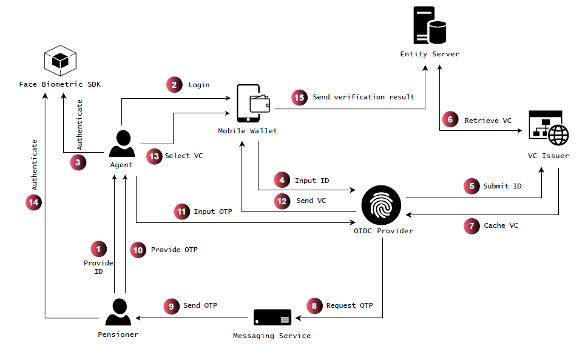

# ENHANCING FINANCIAL INCLUSION VIA ASSISTED AUTHENTICATION USING DIGITAL WALLETS WITH VERIFIABLE CREDENTIALS

This repository includes all the essential resources for implementing assisted authentication using digital wallets with verifiable credentials. The initiative aims to demonstrate how verifiable credentials can be utilized to verify a proof-of-life concept through an assisted model. In this approach, an individual without access to a digital wallet can receive support from an authorized person who possesses a wallet and is permitted to act on their behalf.

## Architecture Diagram
The architecture diagram illustrates an assisted authentication system that utilizes digital wallets with verifiable credentials (VC), integrating biometric authentication and OpenID Connect (OIDC) protocols. 

- `Attendee`: The individual requiring assistance. They might not have access to a mobile wallet or are incapable of operating one but need to be authenticated.

- `Attendant`: A trusted individual who assists the attendee in the authentication process. The attendant has access to a mobile wallet and is authorized to act on behalf of the attendee by wallet of verifiable credential download.

- `Mobile Wallet`: This is a mobile application that will be used to store and manage verifiable credentials.

- `Face Biometric SDK`: This software development kit is integrated into the mobile wallet to capture facial biometric data and confirm match. This ensures that the proof of life or identity verification can be performed securely.

- `Credential Service`: This service is responsible for generating signed and tamper-proof verifiable credential after the successful validation of the attendee's identity. 

- `VC Issuer`: Responsible for issuing signed and tamper-proof verifiable Credentials (VC) generated by the credential service.

- `Entity Server`: This server is responsible for holding essential records or information related to the attendee's identity and their generated verifiable credentials. 

- `OIDC Provider`: The OpenID Connect provider facilitates secure identity verification.

- `Foundational ID System`: This system stores the attendee’s identity information and ensures that the OIDC provider can perform accurate checks.

- `Messaging Service`: This service facilitates communication by sending OTP notifications during the authorization process.

## Usecase Diagram
The diagram represents a use case flow for assisted authentication using verifiable credentials (VC).

## Sequence Diagrams
Here are detailed sequence diagrams for the proposed concept.

### OTP-Based Registration

### Biometric-Based Registration

### Assisted Authentication

## Possible Usecases
The proposed design has several practical applications across various sectors. Here are some of the key uses.

1. **Social Services**
    - `Pension Payments`: In situations where elderly or disabled individuals have difficulty accessing technology, an authorized person (such as an insurance agent) can use their digital wallet to verify the beneficiary’s identity and current status before releasing pensions, ensuring that payments are not mistakenly made to deceased individuals.

    - `Subsidy Distribution`: For welfare programs or financial assistance, verifiable credentials can authenticate eligible individuals even when they do not have digital wallets.

2. **Government Renumeration**
    - `Salary Payment`: The system can be applied to verify the identity and proof-of-life of government employees before salary disbursements. This ensures that only legitimate, active employees receive payments, preventing fraud such as the inclusion of ghost workers in payroll systems.

3. **Voting and Civic Participation**
    - `Voter Verification`: In elections, this system enables authorized personnel to authenticate a voter's identity and eligibility, ensuring that only living individuals participate, thereby preventing vote rigging.

4. **Education**
    - `Student Verification`: During events (like examinations) which require student attendance, an authorized individual (such as a teacher or parent) can verify the presence of a student who lacks access to a digital wallet or is unable to operate one.

In each of these use cases, the system ensures secure, verified access to essential services while maintaining a high level of trust and privacy.

### Flow Diagram For Insurance Usecase
The diagram below illustrates a practical implementation of the proposed design for verifying a pensioner's proof-of-life before the release of their pension payments. This process facilitates seamless access to pensions by ensuring pensioners' identity verification.

